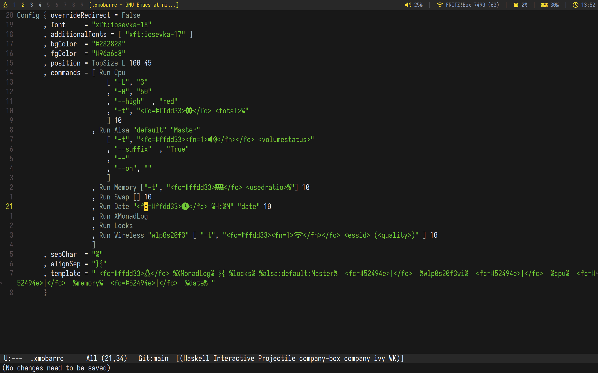

# Dotfiles

Dotfiles&mdash;A place for combining all my GNU/Linux configuration
files.



## Setup

Setting up my dotfiles is pretty much straightforward, as I have
automated it almost completely:

```shell
$ # Create a nix-shell with git and stow available.
$ nix-shell -p git stow

[nix-shell] $ git clone https://codeberg.org/guemax/dotfiles .dotfiles
[nix-shell] $ cd .dotfiles/
[nix-shell] $ # Make the setup script executable
[nix-shell] $ chmod +x setup.sh
[nix-shell] $ sudo ./setup.sh
```

That's it, have fun with your system!

## Permanently enabling Redshift

For permanently enabling Redshift, create the following file:

```shell
~/.config/systemd/user/default.target.wants/redshift.service
```

## HiDPI screen settings

Don't forget to enable scaling for HiDPI screens in Firefox (if you
need that), by going to `about:config` and searching for
`layout.css.devPixelsPerPx`.  I set the value to `1.5`.
